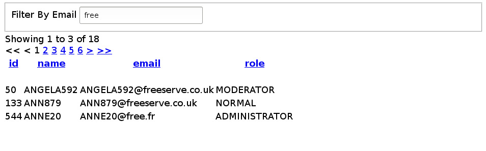

## A mini-webservice demonstrating Wicket and Hibernate.

##### Persists a user record containing a name, email, and role.  Validation requires unique email address, and unique name.

##### Results are paginated, filterable, and orderable by fields.

### Instructions

* mvn clean compile
* mvn jetty:run
* navigate to localhost:8080
